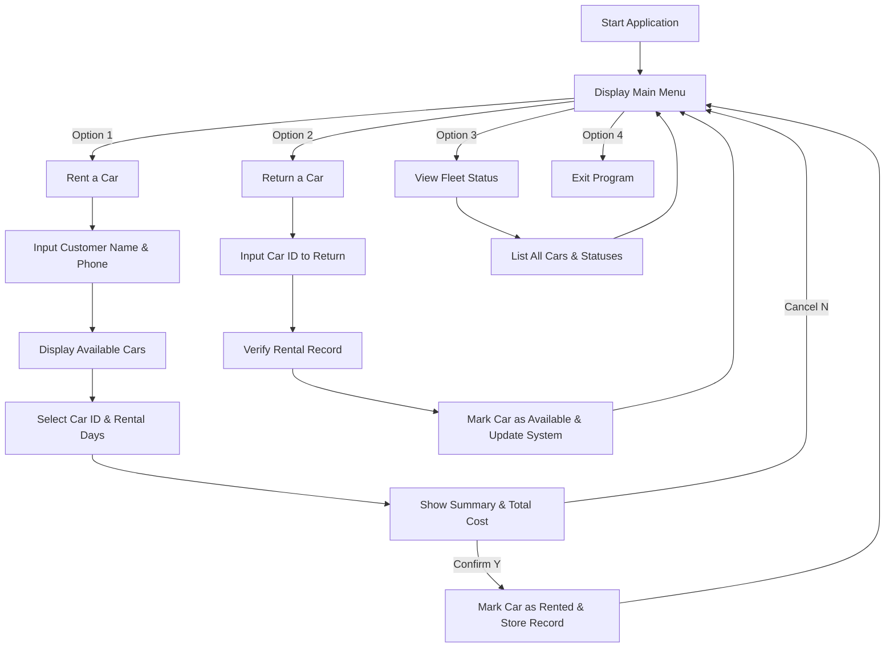

# 🚗 Car Rental System

[](https://www.oracle.com/java/)
[](LICENSE)
[](https://github.com/NikhileshKasthuri/car-rental-system)
[](https://github.com/NikhileshKasthuri/car-rental-system/pulls)

A modern, object-oriented **Car Rental Management System** written in Java. This application provides a seamless, interactive command-line interface for managing vehicle inventory, customer registrations, car bookings, and return workflows with real-time price calculations and availability tracking.

---

## 📌 Table of Contents

- [Overview](#-overview)
- [Key Features](#-key-features)
- [Architecture & OOP Principles](#-architecture--oop-principles)
- [System Workflow](#-system-workflow)
- [Project Structure](#-project-structure)
- [Getting Started](#-getting-started)
  - [Prerequisites](#prerequisites)
  - [Compilation & Execution](#compilation--execution)
- [Usage Walkthrough](#-usage-walkthrough)
- [Future Roadmap](#-future-roadmap)
- [Contributing](#-contributing)
- [License](#-license)

---

## 📖 Overview

The **Car Rental System** is designed to streamline the rental operations of a car rental business. It manages vehicle fleets, maintains customer records, handles booking durations, dynamically calculates rental costs, and tracks vehicle availability status.

Built using core **Object-Oriented Programming (OOP)** principles in Java, the project demonstrates clean code structure, high modularity, and easy scalability for future database or Web GUI integration.

---

## ✨ Key Features

- 🚘 **Vehicle Fleet Management**: Store and display cars with details such as Car ID, Brand, Model, Price per Day, and Availability Status.
- 👤 **Customer Registration**: Automatic generation of unique Customer IDs during the booking process along with customer contact details.
- 💳 **Dynamic Cost Calculation**: Calculates total rental fees based on daily rates and rental duration.
- 🔄 **Real-Time Availability Tracking**: Automatically updates car status to `Rented` upon booking and reverts to `Available` upon return.
- 📜 **Interactive Console Interface**: User-friendly CLI menu with input validation for options, car selection, and confirmation prompts.
- 🛡️ **Robust Error Handling**: Prevents double-booking, invalid car IDs, negative rental days, and incorrect user inputs.

---

## 🏗️ Architecture & OOP Principles

The project strictly follows core Object-Oriented principles:

| Principle | Implementation Details |
| :--- | :--- |
| **Encapsulation** | Private fields in model classes (`Car`, `Customer`, `Rental`) accessed via public getters/setters. |
| **Abstraction** | Hides complexity of pricing calculations and inventory updates behind clean method signatures like `calculatePrice()` and `rentCar()`. |
| **Modular Design** | Separation of concern across domain entities (`Car`, `Customer`, `Rental`), core controller (`CarRentalSystem`), and entry point (`Main`). |

---

## 🔄 System Workflow



---

## 📁 Project Structure

```
car-rental-system/
├── src/
│   ├── Car.java              # Car entity model
│   ├── Customer.java         # Customer entity model
│   ├── Rental.java           # Rental transaction record model
│   ├── CarRentalSystem.java   # System controller & CLI logic
│   └── Main.java             # Entry point & sample data initialization
├── bin/                      # Compiled bytecodes (.class files)
├── .gitignore                # Git ignore rules
├── LICENSE                   # Open-source license (MIT)
└── README.md                 # Project documentation
```

---

## 🚀 Getting Started

### Prerequisites

Ensure you have Java Development Kit (JDK 11 or later) installed on your system.

Check your installation:
```bash
java -version
javac -version
```

### Compilation & Execution

1. **Clone the Repository:**
   ```bash
   git clone https://github.com/NikhileshKasthuri/car-rental-system.git
   cd car-rental-system
   ```

2. **Compile Java Files:**
   ```bash
   javac -d bin src/*.java
   ```

3. **Run the Application:**
   ```bash
   java -cp bin Main
   ```

---

## 💻 Usage Walkthrough

### Main Menu
```text
==========================================
       🚗 CAR RENTAL SYSTEM 🚗           
==========================================
1. Rent a Car
2. Return a Car
3. View Available Cars
4. Exit
Enter your choice (1-4): 
```

### Renting a Car
```text
--- Rent a Car ---
Enter your name: Alex Mercer
Enter your phone number: +1-555-0199

Available Cars:
C001     | Toyota       | Camry        | $60.00/day | Available
C002     | Honda        | Accord       | $70.00/day | Available
C003     | Mahindra     | Thar         | $150.00/day | Available

Enter the Car ID you want to rent: C003
Enter the number of days for rental: 5

=== Rental Information ===
Customer ID: CUST1
Customer Name: Alex Mercer
Car: Mahindra Thar
Rental Days: 5
Total Price: $750.00

Confirm rental (Y/N): Y

🎉 Car rented successfully!
```

---

## 🔮 Future Roadmap

- [ ] **Database Persistence**: Integration with MySQL/PostgreSQL using JDBC or Hibernate/Spring Data JPA.
- [ ] **REST API & Web UI**: Spring Boot backend connected to a React / Vue frontend dashboard.
- [ ] **Payment Gateway**: Integration with Stripe / Razorpay for online rental payments.
- [ ] **PDF Invoice Generator**: Automatic invoice PDF generation for customer receipts.
- [ ] **Admin Analytics**: Dashboard displaying total revenue, most popular cars, and active rentals.

---

## 🤝 Contributing

Contributions are welcome! If you'd like to improve this project:

1. Fork the Repository
2. Create a Feature Branch (`git checkout -b feature/AmazingFeature`)
3. Commit your Changes (`git commit -m 'Add some AmazingFeature'`)
4. Push to the Branch (`git push origin feature/AmazingFeature`)
5. Open a Pull Request

---

## 📜 License

Distributed under the **MIT License**. See [`LICENSE`](LICENSE) for more information.

---

<p center="align">
  Crafted with ❤️ by <a href="https://github.com/NikhileshKasthuri">Nikhilesh Kasthuri</a>
</p>
